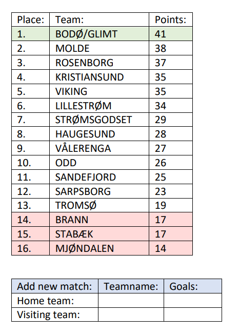
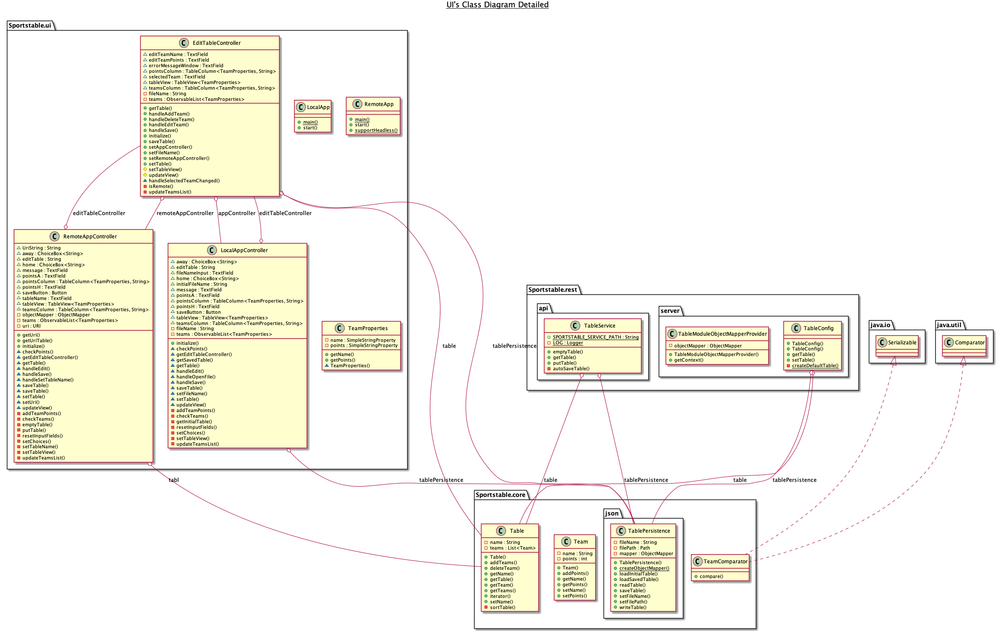
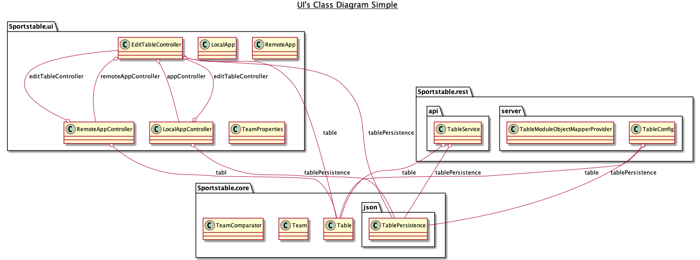
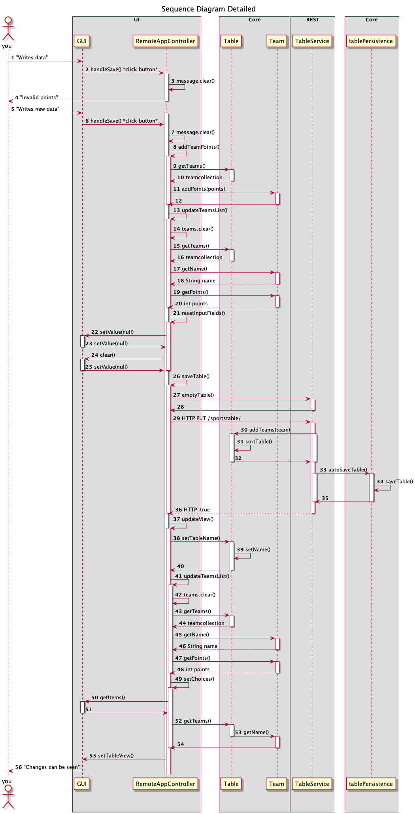
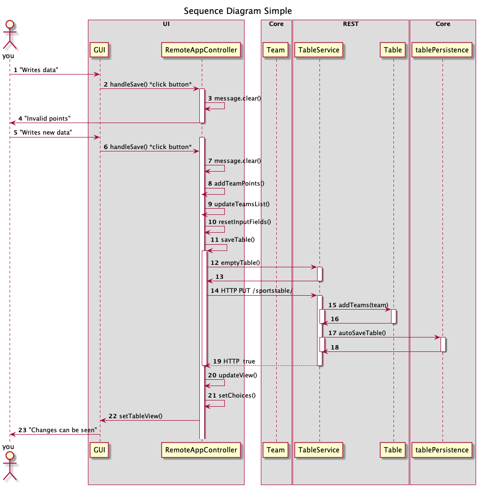

## SportsTable

This project is a multiple-module application. The project is configured using maven. 

### The SportsTable application:

The application shows a table of the Norwegian football League "Eliteserien" for first time users. There is a overview of the teams in the league and their points and placement. The user can add new match results and get an updated table with the new scores and placements of the teams, which will be saved in a json-file located in the users home folder. When the user restart the application after adding match results, they will see their saved version of the table.

If the user wants to make their own table, they can set a new filename and make the new file with an empty table. They can add teams with points in editTable window, and add match results in main window. The table can then be saved locally. The user can then access the saved table in application by writing the table name. 

The application can also run with remote access, so that the table gets saved in remote server (localhost service). The remote table can be edited the same way as when using the table locally. The remote app does not support saving of multiple tables. As long as the server is running, the user will access the saved table in the server even if user stops and start the remote application. 

### Example-image

This is how the table should look when its complete:

### Architecture
**Package Diagram**
 

**Class Diagram**

Detailed:
 

Simple:
 

The modules for the project is:

- core: contains logic for Team and Table objects.
- json: has persistence class and serializer/deserializer for reading and writing Table objects in json-format.
- fxui: have Controller-classes for local and remote running of application and fxml files for ui-layer.
- rest: contains TableService class that gets the the requests from RemoteApp - support requests GET, PUT and DELETE and sends these to localhost service.
- integrationtests: Starting and running the server.

### Project build

**Sequence Diagram**
 
Detailed:

Simple:

In these sequence diagrams you can se one example of how a user can use the application. The diagrams shows how the user,
from the default window, can add results from a new match when the user is using a remote server. 

First the user 
inputs illegal values for points, and gets message "Invalid points" in the error window. Then the user tries again, 
and the poits are valid. Now the rest of 
the application workes without any errors, and the user can finally see how the new match affects the table.

Notic that for better readabilty we have only showed one call to the addTeamPoints() method (call #8 in both diagrams). 
This method will in reality be called twice, one time for the "home-team" and once for the "away-team"
.

