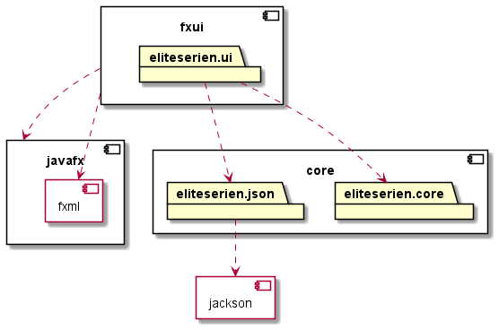

En README.md-fil (evt. en fil som README.md lenker til) inni kodingsprosjektet skal beskrive hva appen handler om og er ment å gjøre (når den er mer eller mindre ferdig). Ha med et illustrerende skjermbilde, så det er lettere å forstå. Det må også være minst én brukerhistorie for funksjonaliteten dere starter med.

# Eliteserien

This project is a two-module application with a domenelayer, UI-layer and persistence layer using json. There will be tests for all layers. The project is configured using maven. 

The application will show a table of the Norwegian football League "Eliteserien". There will be a overview of the teams in the league and their points and placement. It will be possible to add new match results and get an updated table with the new scores and placements of the teams. 

## Example-image

This is how the app should look when its complete:

## Architecture

## How the code is organized

The project is organized with a maven setup:

*core* module:
The core module contains classes with logic that organize and handle all data the application uses and needs to run. The core-module containts the domene layer (src/main/java/core) and the persistence layer(src/main/java/json). These folders are independent from eachother. The core-module is also independent from the fxui-module.

**src/main/java** contains source code and persistence.
**src/main/resources** contains resources (only one json-file for now).

*fxui* module:
This module contains all classes and logic needed to show and use the data from the core-layer. The start-class use the fxml-file from resources to show output. The fxml-file uses the controller to handle input and output from core-module. 
**src/main/java** contains the controller and start-class.
**src/main/resources** contains the fxml file.

Both modules also have test-folders with the same structure as src-folders.